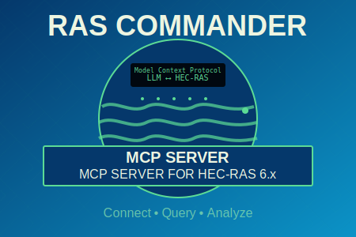

# HEC-RAS MCP Server

<div align="center">
  
</div>  


The RAS Commander MCP (Model Context Protocol) server provides tools for querying HEC-RAS project information using the ras-commander library. This allows Claude Desktop to interact with HEC-RAS hydraulic modeling projects.

## Features

- Query comprehensive HEC-RAS project information (plans, geometries, flows, boundaries)
- Get specific components (plans only, geometries only)
- Support for multiple HEC-RAS versions (6.5, 6.6, etc.)
- Formatted text output suitable for LLM interaction
- Error handling with helpful diagnostics

## Prerequisites

1. **HEC-RAS Installation**: HEC-RAS must be installed on your system (default expects version 6.6)
2. **Python**: Python 3.8+ with Anaconda recommended
3. **Claude Desktop**: For MCP integration

## Installation

1. Clone this repository:
```bash
git clone <repository-url>
cd ras-commander-mcp
```

2. Install dependencies using the Anaconda environment:
```bash
# Create and activate conda environment
conda create -n hecras-mcp python=3.9
conda activate hecras-mcp
pip install -r requirements.txt
```

## Configuration

### Claude Desktop Integration

Add the following to your Claude Desktop configuration file (`claude_desktop_config.json`):

```json
{
  "mcpServers": {
    "hecras": {
      "command": "python",
      "args": ["path/to/your/ras-commander-mcp/server.py"]
    }
  }
}
```

Adjust the paths to match your installation and Python environment.

### HEC-RAS Version Configuration

The MCP server uses HEC-RAS version 6.6 by default. This version is NOT passed directly in tool calls but is configured at the server level. To use a different version of HEC-RAS:

1. **Set HEC-RAS Version** (if you have a different version installed):
   ```json
   {
     "mcpServers": {
       "hecras": {
         "command": "python",
         "args": ["path/to/your/ras-commander-mcp/server.py"],
         "env": {
           "HECRAS_VERSION": "6.5"
         }
       }
     }
   }
   ```

2. **Set HEC-RAS Path** (if HEC-RAS is installed in a non-standard location):
   ```json
   {
     "mcpServers": {
       "hecras": {
         "command": "python",
         "args": ["path/to/your/ras-commander-mcp/server.py"],
         "env": {
           "HECRAS_PATH": "C:\\Program Files\\HEC\\HEC-RAS\\6.5\\HEC-RAS.exe"
         }
       }
     }
   }
   ```

**Important**: If you encounter errors about HEC-RAS not being found, ensure that:
- HEC-RAS 6.6 is installed in the default location, OR
- Change the configuration to match your installed HEC-RAS version using the `HECRAS_VERSION` environment variable, OR
- Specify the full path to your HEC-RAS executable using the `HECRAS_PATH` environment variable

## Usage

### Available Tools

1. **query_hecras_project**: Get comprehensive project information
   - Parameters:
     - `project_path` (required): Full path to HEC-RAS project folder
     - `include_boundaries` (optional): Include boundary conditions (default: false)

2. **get_hecras_plans**: Get only plan information
   - Parameters:
     - `project_path` (required): Full path to HEC-RAS project folder

3. **get_hecras_geometries**: Get only geometry information
   - Parameters:
     - `project_path` (required): Full path to HEC-RAS project folder

4. **get_infiltration_data**: Get infiltration layer data and soil statistics
   - Parameters:
     - `project_path` (required): Full path to HEC-RAS project folder
     - `significant_threshold` (optional): Minimum percentage threshold for significant mukeys (default: 1.0)

5. **get_plan_results_summary**: Get comprehensive results from a specific plan
   - Parameters:
     - `project_path` (required): Full path to HEC-RAS project folder
     - `plan_name` (required): Name of the plan to get results from

6. **get_hdf_structure**: Explore the structure of a HEC-RAS HDF file
   - Parameters:
     - `hdf_path` (required): Full path to the HDF file
     - `group_path` (optional): Internal HDF path to start exploration from (default: "/")

7. **get_projection_info**: Get spatial projection information from HDF files
   - Parameters:
     - `hdf_path` (required): Full path to the HDF file

**Note**: The HEC-RAS version is configured at the server level (see Configuration section above) and is not passed as a parameter to individual tool calls.

### Example Usage in Claude

Once configured, you can ask Claude:

- "Query the HEC-RAS project at C:/Projects/MyRiverModel"
- "Show me the plans in the Muncie test project"
- "Get the geometries from my HEC-RAS model"
- "Get infiltration data for my project with a 5% threshold"
- "Show me the results summary for plan '9-SAs' in my project"
- "Explore the HDF structure of my results file"
- "Get the projection info from my terrain HDF"

### Testing

Run the example client to test the server:

```bash
# Using the activated conda environment
python example_client.py
```

This will query the included Muncie test data and display the results.

## Test Data

The `testdata/Muncie/` folder contains a complete HEC-RAS project for testing, including:
- HDF5 result files
- Terrain data
- Geometry files
- Plan files
- Boundary conditions
- GIS shapefiles

## Troubleshooting

1. **ImportError for ras-commander**: Ensure ras-commander is installed and HEC-RAS is properly installed
2. **Project not found**: Verify the project path exists and contains .prj files
3. **Version errors**: Check that the specified HEC-RAS version matches your installation

## Development

To modify or extend the server:

1. Edit `server.py` to add new tools or modify existing ones
2. Test changes with `example_client.py`
3. Update Claude Desktop configuration if paths change

## License

This project is licensed under the MIT License - see the [LICENSE](LICENSE) file for details.

## Trademarks

See [TRADEMARKS.md](TRADEMARKS.md) for trademark information and compliance policies.